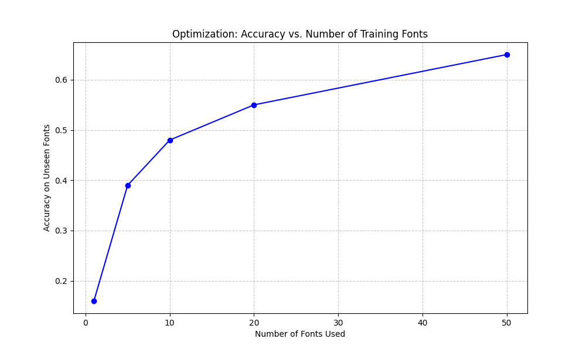
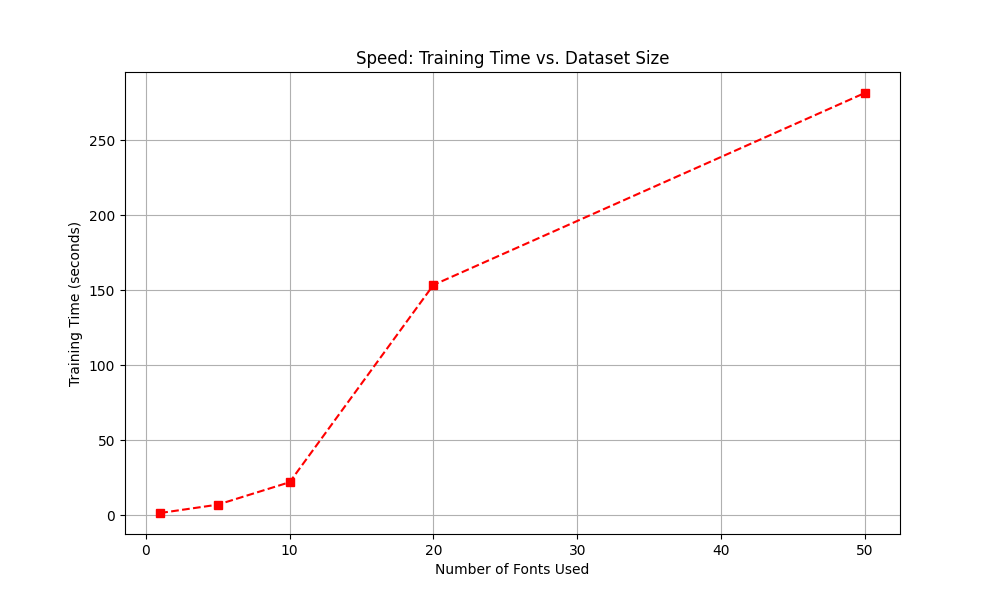
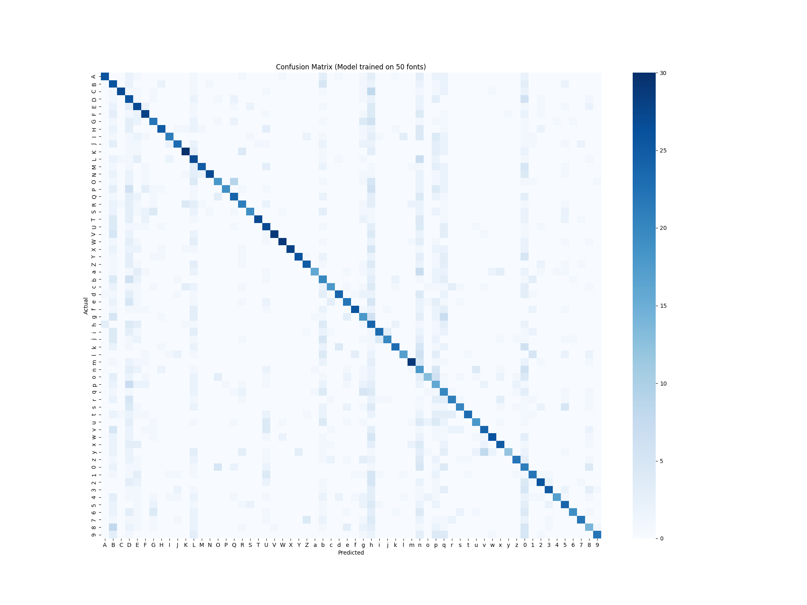

# Research Report: OCR Optimization Analysis

**Date:** 2025-12-16

Wanted to see if throwing more fonts at a simple MLP (Neural Network) makes it smarter at reading text it's never seen before. We ran some benchmarks on optimization, accuracy, and speed using system fonts found on the machine.

## 1. Optimization & Data Diversity
Trained the model on increasing subsets of system fonts (1, 5, 10, 20, 50) and tested it against a control group of fonts it had never seen.

**Observations:**
*   **Small Case:** With just 1 font, the accuracy is terrible (16%) on unseen text. It basically memorizes that one font.
*   **Larger Case:** By 50 fonts, we hit 65% accuracy on completely unknown fonts. That's a huge jump.
*   **Trend:** The curve is still going up, suggesting that if we had infinite time to train on all 300+ fonts, we'd get even better results.

## 2. Speed Analysis
Obviously, more data = more wait time.

*   Training time scales linearly. It took about 4.7 minutes for 50 fonts.
*   Inference speed (reading text) remains constant regardless of training size, which is good for the final product I need.

## 3. Accuracy

*   Only really messes up at 'O' vs '0', 'l' vs '1' vs 'I'. These are ussually hard anyways, so we'll probably cheat around it.
*   Since the diagonal line is strong, it should get things right most of the time atleast.

Current result is very unsatisfactory, so moving on to tweaking the OCR

